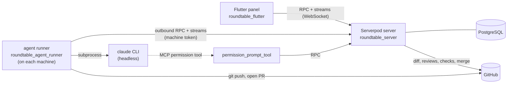

# Roundtable

**A command center for AI coding agents.** Give Claude Code agents tasks
against your GitHub repos, running on your own machines, and follow every
one of them from a single Flutter panel — on your desktop or your phone —
instead of SSH-ing into a box and babysitting a terminal.

> 🎬 Demo video: _link_

## The problem

Running a coding agent today means a terminal window per agent: you start
`claude` on a laptop or a VPS, watch it scroll, answer its questions when you
happen to look, copy its plan somewhere to review, then push and open the PR
yourself. Two agents mean two terminals; an agent on a VPS means an SSH
session you keep coming back to. Nothing tells you an agent is stuck waiting
for you.

**Roundtable is for a developer who wants agents working in parallel on real
repos** while they stay in control of what gets merged. You register your
machines once, create agents on them (a name, a role, a model, an effort
level), and hand them tasks. Roundtable runs each task headlessly and brings
everything that needs you to one place.

## What a task goes through

1. **You create a task** — a prompt (screenshots can be pasted in), a
   project, an agent.
2. **The agent's machine picks it up**, makes a git worktree and a
   `task-<id>` branch, and runs Claude Code.
3. **Plan first** (optional): the agent explores the code and proposes a
   plan. You approve it, or send feedback and it plans again.
4. **Questions come to you**: when the agent needs a decision it asks in
   the panel, and waits for your answer.
5. **Live execution log**: every tool call and message, streamed as it
   happens.
6. **A pull request opens by itself** when the agent is done: committed,
   pushed, with the agent's summary as the description.
7. **Review**: the diff in the panel, an **AI code review** by another agent
   (comments on lines, a verdict), and the PR's **GitHub Actions checks**.
   Send comments or failing CI jobs back to the agent with one click — it
   resumes the same session on the same branch.
8. **Merge** from the panel. Or turn on auto-review, auto-fix and auto-merge
   and only step in when something needs you.

Agents run natively or, per agent, in a rootless **Podman container** that
sees only its task. A machine updates its runner from the panel, and runs
that hit the Claude usage limit pause and resume when it resets.

## Try it

You need Docker, a Claude Pro/Max subscription and a GitHub repo you can
push to.

```bash
docker compose up --build
```

This starts PostgreSQL, the server (which also serves the panel) and a
**demo machine** container running the agent runner, which adds itself to
the server. The first build takes a few minutes (it builds the Flutter web
app). Then open **http://localhost:8082** and:

1. **Machines → demo-machine**: the card says *No Claude token* — click
   **Set token** and paste a token you get by running `claude setup-token`
   on any computer with a browser.
2. **Add agent** on the same card: a name and a role are enough.
3. **Projects → New project**: your repo's URL and a fine-grained GitHub
   token for it with **Contents** and **Pull requests: Read and write**,
   plus **Actions: Read**.
4. **New task** — pick the project and the agent, describe the change,
   and watch it go.

Real machines (a laptop, a VPS) are added with **Machines → Add machine**,
which gives a one-line install command for a Linux host with systemd.

> The panel has no login yet (see [Limits](#limits-of-this-mvp)); the
> compose file publishes its ports on `127.0.0.1` only. Keep it that way.

## How it uses Serverpod

The whole backend is Serverpod — RPC, streaming, the database, background
jobs, file storage and the web server.

| Serverpod feature | What it does here |
|---|---|
| **Endpoints** (`lib/src/endpoints/`) | 100+ RPC methods for the panel and for the machines' daemons; machine calls are authenticated with a per-machine token (stored hashed) |
| **Streaming methods** over one WebSocket | Live everything: the kanban (`watchAllTasks`), log tails, AI reviews, CI checks, machine metrics, and each machine's feed of assigned work. Streams replay current state, then push updates posted with `session.messages.postMessage` |
| **Long-lived streams as a control channel** | The daemon's permission tool blocks on a stream while Claude Code waits for your answer or plan approval |
| **Models & migrations** (`lib/src/models/*.spy.yaml`) | 40+ models; relations, indexes, enums; repo tokens declared `scope=serverOnly` so they never reach the client |
| **Transactions & row locks** | Starting a review claims it under `SELECT … FOR UPDATE`, so two replays can't run it twice |
| **Future calls** (`lib/src/future_calls/`) | Recurring jobs: fail work of machines that went offline, catch stalled tasks, resume runs paused by the usage limit, sync GitHub Actions checks (and auto-merge / auto-fix), clean up metrics and unused attachments |
| **Cloud storage** | Images attached to task prompts, sniffed and stored server-side, downloaded by the runner |
| **Web server** (`lib/server.dart`) | Serves the Flutter web panel, the machine install script, and the runner binaries (rebuilt on demand in development) |
| **Generated client** (`roundtable_client`) | Shared by the Flutter panel **and** the Dart daemon, so a changed endpoint breaks the build on both sides, not at runtime |
| **`serverpod_test`** | ~290 integration and unit tests with `withServerpod`, including concurrency tests against real transactions |

## How it uses Flutter

- **The panel** (`roundtable_flutter/`): one codebase for desktop and web,
  responsive down to a phone — bottom navigation, a column picker for the
  kanban, a one-column task view with tabs and the actions within thumb
  reach (`docs/UI-DESIGN.md` §4).
- **State**: `flutter_bloc` — repositories wrap the generated client, Cubits
  wrap one stream each, and one full Bloc drives the task screen (task
  status, logs, diff, reviews, checks and your actions). Server streams
  reconnect with backoff, and the board catches up on what it missed.
- **A small design system** (`lib/theme/`, `lib/widgets/`): dark-only tokens,
  a status pill, a diff view with inline review comments, markdown plans,
  a kanban card.
- **Dart on the machine too**: the agent runner is a Dart daemon compiled
  to native binaries, sharing the client and models with the panel.

## Architecture



- **Machines connect out to the server** — nothing has to be opened on a
  laptop or a VPS.
- **One worktree, branch and PR per task.** Feedback resumes the same Claude
  session in the same worktree.
- **Secrets stay where they belong.** The repo token lives on the server and
  reaches git only as a header in its environment — never in a URL, a
  command line or `.git/config`. A docker-mode agent's container can't touch
  the repo's git config or hooks, which the host runs.

| Package | |
|---|---|
| `roundtable_server/` | Serverpod backend |
| `roundtable_flutter/` | the panel |
| `roundtable_agent_runner/` | the machine daemon and the MCP permission tool |
| `roundtable_client/` | generated client, shared by both |
| `roundtable_e2e/` | end-to-end tests with a fake GitHub and a fake `claude` |
| `scripts/` | machine install / uninstall |

## Quality

- **~640 tests**: server integration tests on a real (embedded) PostgreSQL,
  the runner against real git repos and fake `claude` processes, and panel
  widget, Bloc and Cubit tests.
- **Reviewed and hardened before submission**: container escape and token
  exposure fixes in the runner (each reproduced by a test against the old
  code), atomic merges and review starts, runs that can't hang forever,
  failure reports that survive a server restart.
- **Documented**: [`docs/`](docs/README.md) covers the architecture, every
  flow step by step, development, the design system and known issues.

## Limits of this MVP

- **No user login.** Anyone who can reach the server controls it — run it
  on localhost, a VPN or behind an authenticating proxy. Login (Serverpod
  auth is already initialized) comes next, together with machine tokens on
  every daemon call. See [`docs/KNOWN-ISSUES.md`](docs/KNOWN-ISSUES.md).
- **Machines are Linux with systemd** (plus the Docker demo machine).
- **GitHub only**, and agents use Claude Code.

## Developing

```bash
serverpod start   # Postgres, server and panel, with hot reload
```

Then [`docs/DEVELOPMENT.md`](docs/DEVELOPMENT.md); AI agents working on the
repo follow [`AGENTS.md`](AGENTS.md).
