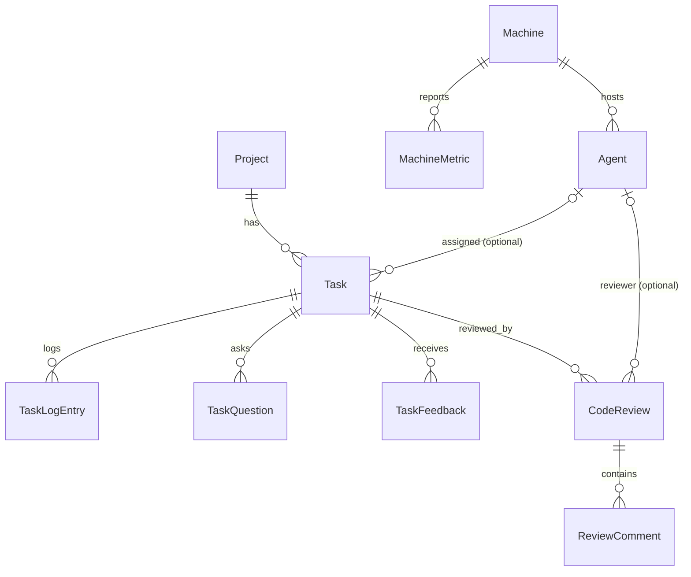

# Architecture

## Components

| Package | What it is | Runs where |
|---|---|---|
| `roundtable_server/` | Serverpod backend: endpoints, models (`.spy.yaml`), migrations, background future calls, GitHub API client, web routes serving the install scripts and runner binaries | central server (local `serverpod start`, or Docker via `docker-compose.yml`) |
| `roundtable_client/` | **Generated** client for the server's endpoints. Never edit it by hand | imported by the panel and the runner |
| `roundtable_flutter/` | The panel (desktop/web), dark-only, `flutter_bloc` | developer's browser/desktop |
| `roundtable_agent_runner/` | Dart daemon compiled to two binaries: `roundtable_agent_runner` (the service) and `permission_prompt_tool` (an MCP stdio server that Claude Code calls) | each registered machine, as the `agent-runner` systemd service |
| `scripts/` | `install-agent.sh` / `uninstall-agent.sh` for a machine. Also served by the server at `/install-agent.sh` and `/uninstall-agent.sh` | target machine (Linux + systemd only) |

### Communication

Serverpod methods returning a `Future` are plain HTTP RPC. Methods returning a
`Stream` are multiplexed over one WebSocket. Live updates are **not** done with
`db.watch()`. Each endpoint posts to a named channel with
`session.messages.postMessage(...)`, and the `watch*` streams listen on those
channels. Most streams first **replay** current state and then yield live
updates.

Channels (in `TaskEndpoint`, `CodeReviewEndpoint`, `task_review_support.dart`):

| Channel | Carries | Consumed by |
|---|---|---|
| `machine-<id>-tasks` | `Task` to start/resume/clean up | runner `watchAssignedTasks` |
| `machine-<id>-reviews` | `CodeReview` to run | runner `watchAssignedReviews` |
| `task-<id>-reviews` | `CodeReview` (with comments) changes | panel `watchReviews` |
| `task-<id>` | `Task` updates | panel task detail, runner (cancel detection) |
| `all-tasks` | every `Task` update | dashboard/project/machine kanbans |
| `task-deletions` | `TaskDeleted` | kanbans |
| `task-<id>-logs` | `TaskLogEntry` | task detail log tail |
| `task-question-<id>` | answered `TaskQuestion` | permission tool, blocked on `AskUserQuestion` |
| `task-<id>-plan-decision` | plan approve/reject | permission tool, blocked on `ExitPlanMode` |

The server also does work in the background with **two recurring future
calls**, registered in `roundtable_server/lib/server.dart`. On every boot it
deletes the existing rows and schedules them again, so they don't pile up:

- `MachineOfflineFutureCall` (every 30 s): a machine whose `lastSeenAt` is
  older than 60 s goes `offline`. All non-terminal tasks of its agents go to
  `failed` ("Machine went offline mid-task").
- `StalledTaskFutureCall` (every 30 s): a task in an agent-driven state
  (`queued`, `cloning`, `planning`, `running`) with no progress
  (`lastProgressAt`) for 15 min goes to `failed`.

## Server endpoints (`roundtable_server/lib/src/endpoints/`)

| Endpoint | Panel-facing | Runner-facing |
|---|---|---|
| `ProjectEndpoint` | CRUD, `updateRepoAccessToken` (write-only token), `delete` (blocked by non-terminal tasks) | `getCloneUrl`: HTTPS URL with the token injected as `x-access-token` |
| `MachineEndpoint` | `register` (returns a one-time token + install command data), `list/get/update/delete`, `getScriptUrl`, `latestRunnerVersion`, `requestRunnerUpdate`, `watchLatestMetric` | token-authenticated: `identify`, `heartbeat`, `checkIn` (heartbeat + version, returns "update requested"), `reportMetric`, `reportClaudeStatus`, `deregister` |
| `AgentEndpoint` | CRUD. `delete` is blocked by non-terminal tasks | `update` (status `idle`/`busy`/`waitingForResponse`) |
| `TaskEndpoint` | `createTask`, `cancelTask`, `retryTask`, `reassignAgent`, `deleteTask`, `answerQuestion`, `approvePlan`, `submitPlanFeedback`, `submitFeedback`, `acceptTask` (squash-merge), `getMergeStatus`, `resolveConflicts`, `getChangedFiles`, `getFileContent`, `watchAllTasks`, `watchTask`, `watchLogs`, `watchTaskDeletions`, `latestQuestion` | `watchAssignedTasks`, `update` (writes only runner-owned columns), `appendLog`, `latestFeedback`, and for the permission tool: `createQuestion`, `watchAnswer`, `setPlanReady`, `watchPlanDecision` |
| `CodeReviewEndpoint` | `requestReview`, `watchReviews`, `setCommentState`, `sendCommentsToFix` | `watchAssignedReviews`, `startReview`, `completeReview`, `failReview` |

Server-only helpers: `github_repo_client.dart` (PR files, file content,
create review, resolve thread, merge, mergeability),
`task_review_support.dart` (shared review/feedback helpers kept out of the
endpoints so they aren't exposed as RPC), `agent_runner_binaries.dart`
(builds the runner binaries, serves them and hashes their version).

`greetings/` is leftover Serverpod scaffold. It isn't used by the app.

## Data model (`roundtable_server/lib/src/models/`)



| Entity | Notable fields |
|---|---|
| `Project` | `repoUrl`, `repoAccessToken` (**serverOnly**), `repoAccessTokenUpdatedAt`, `dockerImage` (unused) |
| `Machine` | `tokenHash` (**serverOnly**, unique index), `status` online/offline, `lastSeenAt`, `claudeExecutableOk/Error`, `runnerVersion`, `updateRequestedAt` |
| `Agent` | `machine` (cascade on delete), `name`, `role`, `defaultModel`, `defaultEffort`, `executionMode` (only `native` is implemented), `status` |
| `Task` | `project` (cascade), `agent` (optional, set null on delete), `prompt`, `skipPlanning`, `status`, `currentPlan`, `failureReason`, `claudeSessionId`, `branchName`, `prUrl`, `startedAt/finishedAt/lastProgressAt` |
| `TaskLogEntry` | `content`, `source` agent/system |
| `TaskQuestion` | `question`, `options`, `answer`, `answeredAt` |
| `TaskFeedback` | `message`, `phase` plan/review |
| `CodeReview` | `reviewerAgent`, `status` queued/running/completed/failed, `summary`, `githubReviewId` |
| `ReviewComment` | `path`, `line`, `body`, `severity` blocker/issue/nit, `state` open/dismissed/sentToFix/resolved, `githubCommentId` |
| `MachineMetric` | `cpuPercent`, `memoryUsedMb/TotalMb`, index on `(machineId, recordedAt)` |

Non-table DTOs: `MachineRegistration`, `DiffFile`, `PrMergeStatus`,
`ReviewCommentDraft`, `TaskDeleted`. Typed exceptions:
`DeletionBlockedException` (`machineOnline` / `nonTerminalTasks`) and
`InvalidTokenException`.

**Non-terminal task statuses** (`endpoints/non_terminal_task_statuses.dart`):
`draft, queued, cloning, planning, waitingForAnswer, planReady, running,
awaitingReview`. These block deleting a machine, agent or project. They also
get failed when the machine goes offline. `cloning` is defined but never set
by the runner today.

Design choices worth keeping:

- `Machine` is infrastructure and `Agent` is a persona. A machine hosts many
  agents. "Offline" exists only on the machine.
- Diffs are not stored. The server fetches them from the GitHub API on
  demand. GitHub can't be iframed (`X-Frame-Options: deny`), so the panel
  renders diffs itself.
- `Task.agent` is optional. A task survives its agent being deleted, and can
  start as an agent-less `draft`.

## Agent runner (`roundtable_agent_runner/`)

- `lib/roundtable_agent_runner.dart`: `AgentRunnerConfig` reads env vars
  (`REGISTRATION_TOKEN`, `SERVER_URL`, `CLAUDE_CODE_OAUTH_TOKEN`,
  `WORKSPACE_ROOT`, `CLAUDE_EXECUTABLE`, permission-tool path, update flag
  path). `AgentRunnerService` runs `identify` (exponential backoff up to 30 s
  while the server is down), subscribes to the assigned task and review
  streams (resubscribes after 5 s on error), runs `checkIn` every 20 s,
  reports metrics every 8 s, and checks that `claude` can be launched.
- `src/task_dispatcher.dart`: runs one task: worktree → Claude
  (planning or execution/resume) → commit/push → open PR → final status.
- `src/review_dispatcher.dart`: runs one code review in a read-only
  detached worktree. It parses the reviewer's final ```json block.
- `src/claude_code_executor.dart`: spawns `claude -p` (`run`,
  `runPlanning`, `runReview`) and parses NDJSON.
- `src/permission_prompt_tool.dart` + `bin/permission_prompt_tool.dart`: a
  hand-rolled MCP stdio server. It handles `AskUserQuestion` and
  `ExitPlanMode` through the server and auto-allows every other tool.
- `src/worktree_manager.dart`: one bare clone per project at
  `<WORKSPACE_ROOT>/<projectId>/repo.git`, and one worktree per task at
  `worktrees/<taskId>` on branch `task-<taskId>`.
- `src/github_pull_request_opener.dart`, `src/metrics_collector.dart`
  (reads `/proc`, Linux only), `src/stream_json_formatter.dart` (turns NDJSON
  into readable log lines), `src/role_prompts.dart` (fixed persona prefix
  per role), `src/runner_update.dart` (version hash and update flag).

## Panel (`roundtable_flutter/lib/`)

- `screens/`: `panel_shell.dart` (nav rail with **Dashboard, Projects,
  Machines**, plus a Settings tile that does nothing), `dashboard_screen.dart`
  (kanban + machines panel), `projects_screen.dart` →
  `project_detail_screen.dart`, `machines_screen.dart` (machines with their
  agents folded in; there is no separate Agents screen) →
  `machine_detail_screen.dart`, `task_detail_screen.dart`.
- State (per the Cubit-by-default rule): `repositories/` wrap the generated
  `client`. `cubits/` wrap one stream or one form each. `blocs/task_detail_bloc.dart`
  is the only full Bloc. It combines task status, logs, PR files and merge
  status, code reviews, and user actions.
- Kanban columns (`cubits/dashboard_cubit.dart`): **Backlog** (draft, queued,
  cloning) · **In progress** (planning, waitingForAnswer, planReady, running)
  · **Review** (awaitingReview) · **Done** (done, failed, cancelled).
- `utils/`: `task_status_label.dart` (human-readable status labels),
  `relative_time.dart`, `code_language.dart`.

## Auth and secrets

- **Machine ↔ server:** `register` generates a random token and stores only
  its hash. Runner-facing `MachineEndpoint` methods look up the machine by
  token. `deregister` clears the hash.
- **Panel ↔ server: no authentication.** Serverpod's email IdP is initialized
  in `server.dart` and `client.dart`, but no endpoint calls `requireLogin` and
  the panel has no sign-in screen. Anyone who can reach the API can do
  anything. See [KNOWN-ISSUES.md](KNOWN-ISSUES.md).
- **GitHub token** (`Project.repoAccessToken`): `serverOnly`, never returned
  to the panel. The runner gets it only inside the clone URL at task start and
  uses that URL as a one-off push target, never as a saved remote.
  `getFileContent` refuses URLs that don't point at `api.github.com`.
- **Claude token** (`CLAUDE_CODE_OAUTH_TOKEN`, from `claude setup-token`):
  lives only in `/etc/agent-runner/config.env` (mode 600) on the machine.
  It never reaches the server. All agents on one machine share one Pro/Max
  subscription's limits.
