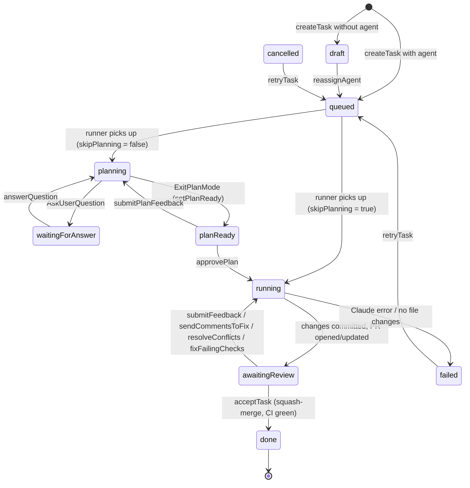

# Key flows

Everything below matches the current code. File references are given so you
can jump straight in.

## 1. Adding a machine

1. Panel → **Add machine** (`widgets/add_machine_dialog.dart`) →
   `MachineEndpoint.register(name)`. The server generates a random token,
   stores only `tokenHash`, and returns `MachineRegistration` (token,
   `serverUrl`, `scriptUrl`). The token is shown **once** with a ready-made
   command:
   `curl -fsSL <scriptUrl>/install-agent.sh | sudo bash -s -- --token … --server … --claude-token …`
2. `scripts/install-agent.sh` (Linux + systemd) does the following:
   - creates the system user `roundtable-agent` with home `/var/lib/agent-runner`
   - downloads both binaries from `/agent-runner-bin` and
     `/permission-prompt-tool-bin`
   - writes `/etc/agent-runner/config.env` (mode 600), resolving an absolute
     `CLAUDE_EXECUTABLE` path
   - installs and starts `agent-runner.service`, plus the root-side updater
     units `agent-runner-update.{service,path}`
3. The daemon starts. It calls `identify(token)` to learn its machine id,
   then `reportStartup(token)`, subscribes to its task and review streams,
   and starts the `checkIn`/metric/worktree-sweep loops. The machine goes
   `online`.
4. The daemon reports whether `claude` can be launched
   (`reportClaudeStatus`). If it can't, the machine card shows a warning
   banner (`widgets/claude_warning_banner.dart`).
5. Adding agents to the machine after that is only a database write
   (`widgets/add_agent_dialog.dart` → `AgentEndpoint.create`).

Claude auth: run `claude setup-token` once on any browser-capable device and
pass the result with `--claude-token`. Details are in `scripts/README.md`.

## 2. Updating the runner on a machine

The server serves binaries built from the current source (in dev they're
rebuilt automatically whenever runner or client sources change; see
`agent_runner_binaries.dart`). The version string is the content hashes of
both binaries.

`checkIn` reports the installed version. The Machines screen compares it with
`latestRunnerVersion` and shows **Update** (`widgets/runner_update_banner.dart`).
If an agent on that machine is mid-task, it asks for confirmation first,
because the restart kills the run.

```
Update click → requestRunnerUpdate (sets updateRequestedAt)
→ next checkIn (≤20 s) returns true
→ daemon writes /var/lib/agent-runner/update-requested
→ agent-runner-update.path fires as root → re-download binaries → restart service
→ new version reported → server clears updateRequestedAt
```

Machines installed before this mechanism existed have to re-run the install
script once.

## 3. Removing a machine

- `MachineEndpoint.delete` is blocked while the machine is **online**
  (`DeletionBlockReason.machineOnline`) and while any of its agents has a
  non-terminal task. In the online case the panel shows the uninstall command
  (`widgets/machine_online_delete_blocked_dialog.dart`, URL from
  `getScriptUrl`).
- `uninstall-agent.sh` stops and removes the service, then calls
  `deregister(token)`. The server first sets the machine `offline` and clears
  `tokenHash`. It then fails the agent runs that died with the daemon (as
  `reportStartup` does), plus its agents' `queued` and `running` code reviews,
  which no daemon is left to pick up. Finally it **deletes the machine**, so
  the dev doesn't click "Delete" a second time; the panel's periodic refresh
  drops the card. If the machine's agents still have other non-terminal tasks
  (queued, awaiting review, …), the machine just stays offline, and the dev
  deletes it from the panel once those tasks are resolved.
- Deleting a machine (either way) also fails any still-active code reviews of
  its agents, since `CodeReview.reviewerAgent` is `SetNull` and a reviewer-less
  `queued` review would block its task forever.
- If the machine is simply gone, `MachineOfflineFutureCall` marks it offline
  within about 60 s.

## 4. Task lifecycle



Any non-terminal status can go to `cancelled` (`cancelTask`). A task can
also go to `failed` in three cases:
- its machine goes offline
- it stalls for 15 min (agent-driven states only)
- the runner restarts while the task is in `planning`/`waitingForAnswer`/
  `planReady`/`running`. `reportStartup` fails such tasks, because their
  `claude` process is gone, and also fails running code reviews.

`deleteTask` is allowed only in terminal states and drafts. Once a task is
terminal, the runner can't change it through `update` anymore.

### Step by step

1. **Create** (`widgets/create_task_dialog.dart` → `TaskEndpoint.createTask`).
   With an agent, the task is `queued` and gets posted to
   `machine-<id>-tasks`. Without one, it's a `draft` until `reassignAgent`.
   On (re)subscribe, `watchAssignedTasks` replays queued tasks so nothing is
   lost while the daemon is down.
2. **Dispatch** (`TaskDispatcher.handle`). It gets the clone URL
   (`getCloneUrl`, token embedded), runs `ensureProjectCloned` (bare clone),
   then `createWorktree` (`task-<id>`, reused for later iterations). The agent
   goes `busy`.
3. **Claude run** (`ClaudeCodeExecutor`). Every run uses
   `claude -p --output-format stream-json --verbose --include-partial-messages`
   plus `--model`/`--effort` from the agent, and an `--mcp-config` (written to
   a temp dir, *not* the worktree) that registers the permission tool.
   - Planning: `--permission-mode plan --permission-prompt-tool mcp__roundtable-permission__approval_prompt`.
     **Planning and execution happen in one process.** An approved
     `ExitPlanMode` doesn't end it; Claude continues straight into
     implementation.
   - `skipPlanning` or resume: execution mode, with `--resume <claudeSessionId>`
     when resuming.
   - The prompt is `"<role prefix> <task prompt>"` (`role_prompts.dart`). On a
     resume, the prompt is the feedback text.
4. **Logs.** Each NDJSON line goes through `StreamJsonFormatter` →
   `appendLog` → `task-<id>-logs`, which also bumps `lastProgressAt`. The
   panel tails it in `TaskDetailBloc`.
5. **Plan mode gates** (`permission_prompt_tool.dart`). Claude calls the MCP
   tool for every non-read-only tool use:
   - `AskUserQuestion` → `createQuestion` (task → `waitingForAnswer`, agent →
     `waitingForResponse`). The tool blocks on `watchAnswer`. The panel
     answers with `answerQuestion` (task → `planning`), and the answer goes
     back to Claude in its `answers` map.
   - `ExitPlanMode` → `setPlanReady(plan)` (task → `planReady`). The tool
     blocks on `watchPlanDecision`. `approvePlan` → allow (task →
     `running`). `submitPlanFeedback` → deny with the feedback as the reason,
     and Claude plans again (task → `planning`).
   - Every other tool → auto-allow.
6. **Finish.** Cancelled during the run → `SIGTERM`, reset the worktree,
   `cancelled`. Success with changes → commit + push `task-<id>`, open a PR
   on the first run (later runs push to the same PR) → `awaitingReview`.
   Success with **no changes on the first run** → `failed` ("Agent finished
   without changing any files."). Every outcome sets the agent back to `idle`.
7. **Review in the panel** (task detail, diff sub-state). `getChangedFiles`
   and `getFileContent` are proxied through the server using the project
   token. `getMergeStatus` asks GitHub whether the PR has conflicts.
8. **Iterate**:
   - `submitFeedback(message)` → `TaskFeedback(phase: review)` → the daemon
     resumes the same Claude session in the same worktree. A replay after a
     daemon restart is ignored if the feedback is older than `finishedAt`.
   - `resolveConflicts` sends a fixed prompt: merge `origin/<base>`, resolve
     the conflicts, build/test, commit, push. It goes through the same resume
     path.
   - `fixFailingChecks(jobIds?, note?)` sends the failing CI jobs (see "CI
     checks" below) with their log tails. Same resume path.
9. **Accept** (`acceptTask`). It first re-reads the CI checks from GitHub
   and refuses while they're `pending` or `failure`, or while a fix run is
   queued for the agent (a new commit without any workflow run counts as
   pending for 2 min, then as "no CI"). "Merge anyway" (`force: true`, behind
   a confirm dialog) skips that gate for a flaky or non-required job;
   GitHub's branch protection still applies. The merge is pinned to exactly
   `prHeadSha` (GitHub's `sha` guard), so a commit pushed after the checks
   were read can't be merged unchecked. Merged → `done`. If GitHub
   refuses (405/409 with conflicts), the task stays in `awaitingReview` and
   the panel shows "resolve conflicts". The `done` task is posted to the
   machine so the daemon removes the worktree. Accepting is blocked while a
   code review is still queued or running. Worktrees the daemon wasn't told
   about (deleted tasks, or failures while it was offline) are removed by the
   30-minute `WorktreeJanitor` sweep.

### CI checks (GitHub Actions)

`PrChecksFutureCall` (every 30 s) runs `syncChecks` (`lib/src/pr_checks.dart`)
for every `awaitingReview` task with a PR and a project token — every time
while its checks are `pending`, every 5 min once they settled. The polled
GETs are conditional (ETag / `If-None-Match`), and a `304` doesn't count
against the token's rate limit, which merges and reviews share. The token
needs the **Actions: read** permission. Without it (a 403/404 from the
Actions API) the checks are reported as unknown: `checkState = none`,
`checkError` set and shown in the panel, and merging is left to GitHub's
branch protection.

1. `GET /pulls/<n>` gives the head commit. A new one (a fix run's push or a
   manual push) replaces the previous commit's `PrCheckRun` rows, sets
   `prHeadSha`/`prHeadSeenAt` and logs "New commit … — CI checks restarted".
2. `GET /actions/runs?head_sha=…`, and for every run that isn't finished
   (or not stored yet) `GET /actions/runs/<id>/jobs?filter=latest` — all
   pages of both. Only the
   latest attempt counts, so a re-run on GitHub resets the job to pending.
3. `Task.checkState`: `failure` if any job failed/timed out/was cancelled,
   `pending` if any is still running, `success` when all passed, `none`
   when no workflow ran. Changes go to `task-<id>`, `all-tasks` and
   `task-<id>-checks`, and to the timeline ("CI failed: …", "CI passed").
4. Every fix run (`queueReviewFeedback`: feedback, review comments,
   conflicts, CI) sets `checkState = pending`: its push makes the current
   results stale. Syncs keep it `pending` while the fix run is still queued
   (review feedback newer than `finishedAt`, the daemon's own rule), so the
   same failure can't be sent twice nor the PR merged under it. When the
   runner reports the task back in `awaitingReview`, `update` syncs right
   away. A fix run that pushed nothing gets its real state back from the
   unchanged commit.
5. Auto-fix (`Task.autoFixFailingChecks`, defaulted from the project or
   workspace when the task is created): once all jobs finished and
   some failed, the failure is sent like `fixFailingChecks` — once per
   commit (`checkFixSentForSha`) and at most `maxCheckFixAttempts` times
   until the checks pass (`checkFixAttempts` resets on `success`). Both
   that and "no fix run queued" are re-checked in a serializable
   transaction, so concurrent syncs can't queue two fix runs.

Other actions: `retryTask` (failed/cancelled → fresh `queued`, clears
`claudeSessionId`), `reassignAgent` (allowed in draft/queued/cloning/
awaitingReview, or when the task has no agent).

## 5. AI code review

1. On a task in `awaitingReview`, **Request review**
   (`widgets/request_review_dialog.dart`) → `CodeReviewEndpoint.requestReview(taskId, agentId)`.
   The reviewer must be `idle`, and only one active review is allowed per
   task. The review is posted to `machine-<id>-reviews`.
2. `ReviewDispatcher` → `startReview` (review `running`, reviewer `busy`) →
   `createReviewWorktree` (a detached checkout of the task branch, so it works
   on any machine) → `runReview`, a read-only Claude run (restricted
   `--allowedTools`/`--disallowedTools`) using `buildReviewPrompt`
   (`git diff <mergeBase>...HEAD`, reply ending in one ```json block with
   `summary` + `comments[]{path,line,severity,body}`).
3. `completeReview` stores the `ReviewComment`s and mirrors them to the PR as
   a single GitHub review. Comments on lines outside the diff are folded into
   the review body. Mirroring is best effort. `failReview` is used when no
   valid JSON comes back.
4. Triage in the panel (`widgets/review_comment_card.dart`):
   `setCommentState` (dismiss / reopen / resolve; resolving also resolves the
   GitHub thread). `sendCommentsToFix(commentIds, note)` marks them
   `sentToFix` and queues a review-phase feedback run. When that run reaches
   `awaitingReview` again, `TaskEndpoint.update` marks them `resolved`.

## 6. Machine metrics

Every 8 s the daemon reads `/proc/stat` and `/proc/meminfo` and calls
`reportMetric`. `watchLatestMetric` streams the newest row to
`MachineMetricCubit` → `MachineMetrics` on the machine cards.
`MachineMetricCleanupFutureCall` keeps one hour of history.
