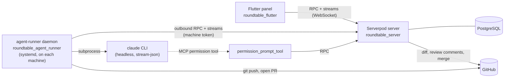

# Roundtable documentation

Roundtable is a command center for AI coding agents. You register your
machines (a laptop, a VPS), create **agents** on them (named personas with a
role, model and effort level), and give them **tasks** against a GitHub repo.
Each agent runs Claude Code headlessly. You follow the work from one Flutter
panel: live logs, plan approval, clarifying questions, diff review, AI code
review, and merging the PR. You don't have to SSH in and watch a terminal.

This folder describes the code **as it is today**. Earlier specs and bug lists
(`DESIGN-DOC.md`, `ISSUES.md`, `TASK-EXECUTION-BUGS.md`) were folded in here.
They're still in git history if you need them.

| Doc | Read it when you want to know… |
|---|---|
| [ARCHITECTURE.md](ARCHITECTURE.md) | what the pieces are, how they talk, the data model, auth/secrets |
| [FLOWS.md](FLOWS.md) | what happens step by step: machine install/update, task lifecycle, plan mode, code review, merge |
| [DEVELOPMENT.md](DEVELOPMENT.md) | how to run, test and change things locally; repo layout; conventions |
| [UI-DESIGN.md](UI-DESIGN.md) | design tokens, component patterns, which screen lives in which file |
| [KNOWN-ISSUES.md](KNOWN-ISSUES.md) | verified open bugs, gaps and accepted limitations |

Agent-facing working rules (MCP tools, generated code, the after-change
checklist) are in [`/AGENTS.md`](../AGENTS.md). The machine install scripts
are documented in [`/scripts/README.md`](../scripts/README.md).

## The 30-second picture

Key ideas:

- **The agent machine connects outbound to the server.** Nothing has to be
  exposed on the VPS.
- **The panel and the daemon share one generated client**
  (`roundtable_client`), so endpoint changes break the build on both sides
  instead of failing at runtime.
- **One git worktree per task, one branch `task-<id>` per task, one PR per
  task.** Feedback iterations resume the same Claude session in the same
  worktree.
- **Secrets stay where they belong.** The GitHub token lives server-side
  (`scope=serverOnly`). The Claude OAuth token stays on the machine.
